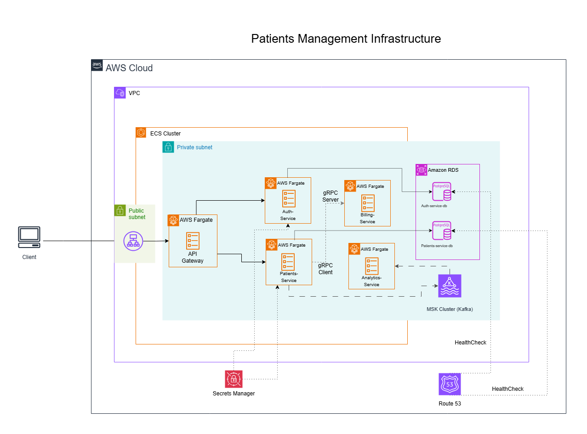

#  Patients Management Microservices

Este proyecto es una **API basada en microservicios** para la gestión de pacientes. Simula un entorno real de despliegue en AWS utilizando herramientas modernas como Kafka, Docker, AWS, LocalStack (para simular entorno de AWS de manera local), entre otras.

---

## 🧩 Infraestructura en AWS


## 📌 Tabla de contenidos

- [🚀 Características](#-características)
- [🛠️ Tecnologías](#-tecnologías)
- [📦 Microservicios](#-microservicios)
- [☁️ Despliegue](#-despliegue)
- [🧪 Tests](#-tests)
- [💻 Ejecutar localmente](#-ejecutar-localmente)
- [📖 Documentacion API](#-documentacionAPI)
---

## 🚀 Características

- Gestión completa de pacientes (CRUD).
- Autenticación y autorización segura con JWT.
- Comunicación entre servicios con **Apache Kafka**.
- Despliegue automatizado con **AWS CDK**.
- Emulación local de la nube con **LocalStack**.

---


## 🛠️ Tecnologías

- **Java & Spring Boot**
- **Kafka (MSK)**
- **gRPC**
- **PostgreSQL (RDS)**
- **Docker**
- **AWS CDK** (Infraestructura como código)
- **ECS + Fargate** (Ejecución de contenedores)
- **Secrets Manager**
- **Route 53** (Health checks)
- **ALB (Application Load Balancer)**
- **LocalStack** (Simulación de servicios AWS)
- **JUnit** (Testing)
- **Swagger ui** (Para documentacion de la API)

---

## 📦 Microservicios

| Servicio           | Descripción                                           |
|--------------------|-------------------------------------------------------|
| `patients-service` | Manejo CRUD de pacientes                              |
| `auth-service`     | Registro, login, emisión y validación de tokens JWT  |
| `billing-service`  | Procesamiento de pagos y facturación                  |
| `analytics-service`| Reportes y estadísticas basadas en eventos de Kafka  |
| `api-gateway`      | Punto de entrada unificado para todos los servicios  |

---

## ☁️ Despliegue

### 🧱 Infraestructura con CDK

Se utiliza AWS CDK para definir los siguientes recursos:

- Contenedores en ECS + Fargate
- Base de datos PostgreSQL con RDS
- Kafka con MSK
- Secrets en AWS Secrets Manager
- Balanceador de carga (ALB)
- Health checks con Route 53

### 🧪 Simulación con LocalStack

Se puede simular el entorno AWS localmente usando [LocalStack](https://github.com/localstack/localstack).

```bash
# Ejecutar entorno local
docker-compose up --build
```

---

## 🧪 Tests

- Pruebas de integración con **JUnit 5**.

---

## 💻 Ejecutar localmente

```bash
# Clonar repositorio
git clone https://github.com/JorgeJ97/patients-management-microservices.git
cd patients-management-microservices

# Levantar entorno local
docker-compose up --build
```

Accede al API Gateway en: [http://localhost:4004](http://localhost:4004)

---

## 📖 Documentacion API


